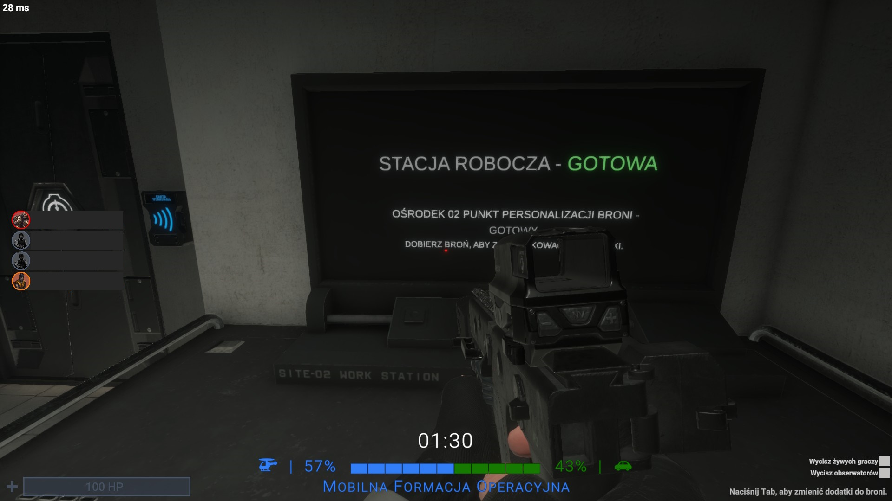
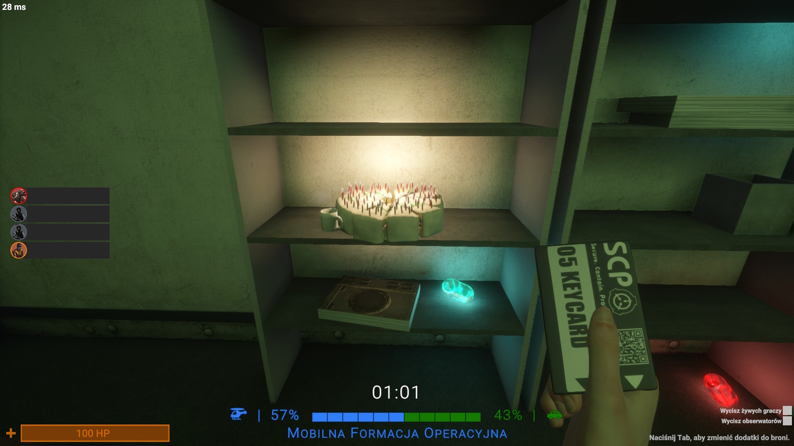
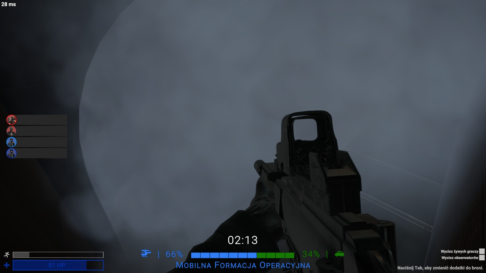

# Easy Respawn Timer | Version 1.0.0
Easy Respawn Timer is a plugin that shows at what time the next wave will arrive and which faction(MTF/CI) will spawn during that wave.

## <code style="color : Green">Simple to configure</code>
> Change the names of the factions(<code style="color : Blue">MTF</code>/<code style="color : Green">CI</code>) that are displayed on the timer
>
> Change the description that is displayed when a faction(<code style="color : Blue">MTF</code>/<code style="color : Green">CI</code>) is spawned
> 
> Change the icons of the factions displayed on the timer(<code style="color : Blue">MTF</code>/<code style="color : Green">CI</code>)
> 
> Change the colour of the timer to whatever you want(Timer is divided into <code style="color : Blue">MTF</code>/<code style="color : Green">CI</code> fractions)
> 
> Change the emoji that will be displayed as a bar

## <code style="color : Blue">This is how it looks in the game</code>

## <code style="color : Green">Download now!</code>
<a href="#" class="button big">Download</a>
